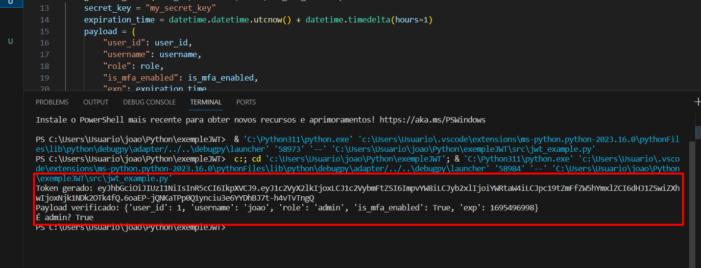
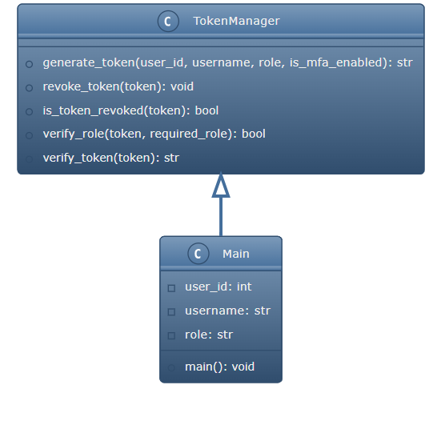
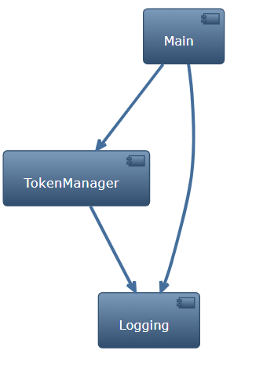
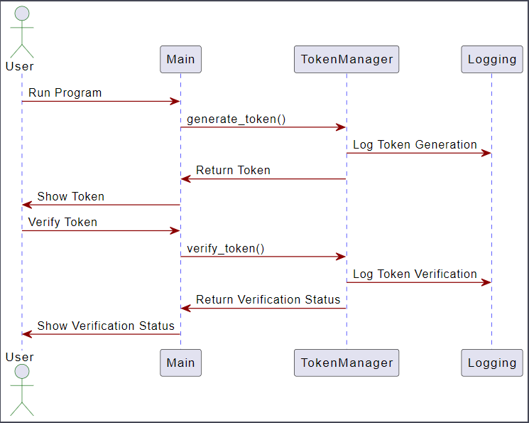

# Projeto JWT em Python
Este projeto demonstra a implementação de um sistema de autenticação JWT (JSON Web Token) em Python. Ele permite gerar tokens de acesso e tokens de atualização, revogar tokens e verificar tokens.

## Como executar

1. Clone o repositório.
2. Execute main.py.

ao executar esse será o resultado:

- ()

## Características
* Geração de token de acesso
* Geração de token de atualização
* Revogação de token
* Verificação de token
* Verificação de função

## Diagramas

Para ajudar a entender melhor a estrutura e o fluxo do código, aqui estão alguns diagramas:

### Diagrama de Classe
O Diagrama de Classe mostra as classes envolvidas no projeto e suas relações.

### Diagrama de Componente
O Diagrama de Componente ilustra como os principais componentes do sistema interagem entre si.

### Diagrama de Sequência
O Diagrama de Sequência atualizado, agora com cores personalizadas, detalha o fluxo de interações entre o usuário, o programa principal e o gerenciador de tokens.

